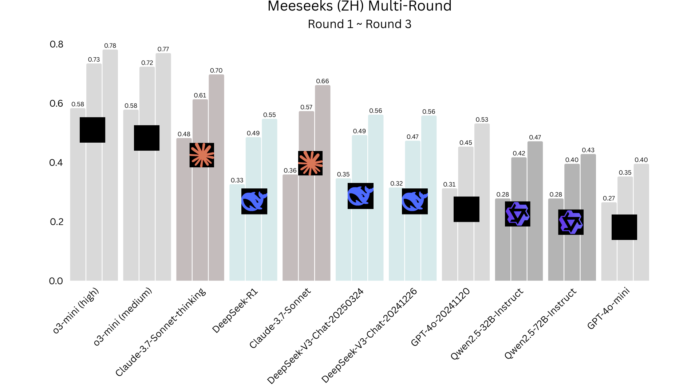

# 👑 Meeseeks Benchmark

## 📖 Introduction
**Meeseeks** is an **instruction-following benchmark** designed to evaluate how well models can adhere to user instructions in a **multi-turn scenario**.  
A key feature of Meeseeks is its **self-correction loop**, where models receive structured feedback and must refine their responses accordingly.  

This benchmark provides a realistic evaluation of a model’s **adaptability, instruction adherence, and iterative improvement**.

---

## Quick Example

<table style="text-align: center; width: 80%; margin: 0 auto;">
<thead>
<tr>
  <th style="text-align: center; width: 25%;">ROUND1-输入</th>
  <th style="text-align: center; width: 45%;">评测内容</th>
  <th style="text-align: center; width: 30%;">对应能力项</th>
</tr>
</thead>
<tbody>
<tr>
  <td colspan="3" style="text-align: center;"><strong>指令遵循单项</strong></td>
</tr>
<tr>
  <td rowspan="5" style="text-align: center; vertical-align: middle; width: 100px; max-width: 100px; word-wrap: break-word; font-size: 20px; padding: 8px;">在短视频的评论区，以消费者角度生成32条用户口语化评论和40条用户非口语化评论。每条评论为7个字，不允许出现以下词语:这个,好,坏,不错,很,很棒</td>
  <td style="text-align: center;">是否生成了32条用户口语化评论</td>
  <td style="text-align: center;">条数约束</td>
</tr>
<tr>
  <td style="text-align: center;">是否生成了40条用户非口语化评论</td>
  <td style="text-align: center;">条数约束</td>
</tr>
<tr>
  <td style="text-align: center;">所有评论是否为7个字</td>
  <td style="text-align: center;">0~10字、精确</td>
</tr>
<tr>
  <td style="text-align: center;">评论是否不重复</td>
  <td style="text-align: center;">重复</td>
</tr>
<tr>
  <td style="text-align: center;">评论是否不包含以下词语:这个,好,坏,不错,很,很棒</td>
  <td style="text-align: center;">关键词</td>
</tr>
<tr>
  <td colspan="3" style="text-align: center;">💡 <strong>让我们激活多轮模式！</strong></td>
</tr>
<tr>
  <td colspan="3" style="text-align: center;"><strong>ROUND2 - 输入（若ROUND1模型输出未满足需求："所有评论是否为7个字"）</strong></td>
</tr>
<tr>
  <td colspan="3" style="text-align: center; word-wrap: break-word;">你的回答中存在以下问题：所有评论是否为7个字：❌ 存在内容字符数量不匹配此range[7, 7] [妈妈希望你以后可以一帆风顺]字数为：13请根据这些信息给出你修正后的回答，注意：只输出回答，不要输出额外信息。</td>
</tr>
<tr>
  <td colspan="3" style="text-align: center;"><strong>ROUND3 - 输入 ...</strong></td>
</tr>
<tr>
  <td colspan="3" style="text-align: center;">...</td>
</tr>
</tbody>
</table>

---

## 📊 Leaderboard

---

## 🚀 Quick Start

We provide three example scripts to help you get started quickly:

- **`example_run_chinese.sh`** → Run Meeseeks (Chinese) dataset  
- **`example_run_english.sh`** → Run Meeseeks (English) dataset  
- **`example_run_custom.sh`** → Run your own dataset  

> ℹ️ **Note:**  
> Meeseeks (English) and Meeseeks (Chinese) share the **same content**, but their **evaluation pipelines are different**.

---

## ⚙️ Requirements

Before running any script, you must implement **three model APIs**:

1. **Test Model**  
   - Argument: `--tested_model_url`  
   - The model you want to evaluate.  

2. **Extract Model** *(Recommended: `Qwen2.5-Coder-32B-Instruct`)*  
   - Argument: `--qwen_url`  
   - Used to extract structured outputs from model responses.  

3. **Score Model** *(Recommended: `Qwen2.5-32B-Instruct`)*  
   - Argument: `--qwen_coder_url`  
   - Used to evaluate and score the extracted results.  

---

## 💡 Hardware & API Options

- If you **have a GPU**:  
  We recommend using the open-source **Qwen2.5 series** models for extraction and scoring.  

- If you **don’t have a GPU**:  
  You can use **commercial APIs** instead.  
  - ✅ *Highly recommended:* **Claude 3.7 Sonnet**  
  - Alternative APIs may also be integrated as long as they follow the input/output format.  

---

## 📂 Results

- Chinese evaluation results will be stored in:  
evaluation_results_chinese/
- English evaluation results will be stored in:  
evaluation_results_english/

Each directory contains structured logs, extracted outputs, and scoring results for further analysis.
